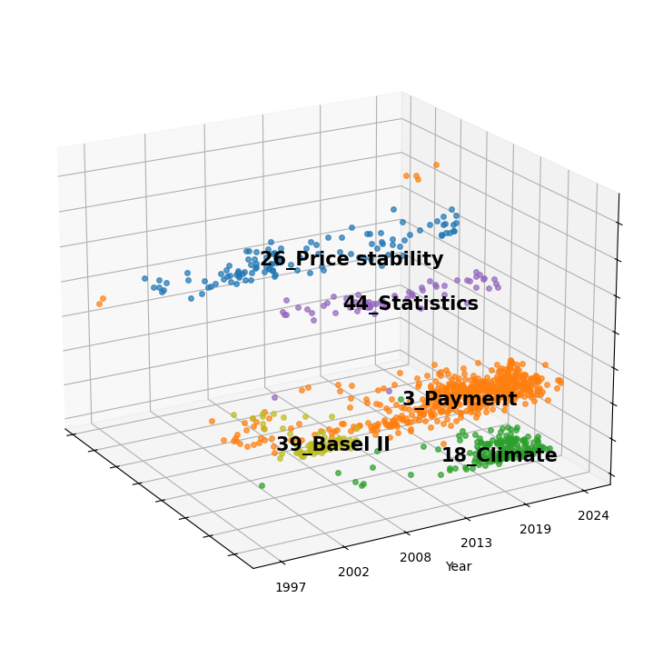

# Central Bank Speeches: A Space of Central Bankers’ Ideas

[](https://www.python.org/downloads/release/python-3126/)
[](https://github.com/MaartenGr/BERTopic)

This project analyzes central bank speeches to uncover patterns, trends, and topics of interest. Using advanced natural language processing (NLP) techniques, such as BERTopic and UMAP, it clusters and visualizes speech data to provide insights into central bank policies and economic discussions.



## Features

- **Topic Modeling**: Extracts topics from central bank speeches using BERTopic.
- **Visualization**: Generates 2D and 3D visualizations of topics and their relationships.
- **Statistical Analysis**: Provides insights into speech distributions by year, speaker, and central bank.
- **Customizable Models**: Supports embedding models like SentenceTransformers and OpenAI GPT-based representations.
- **Data Export**: Saves results in various formats, including Excel, Parquet, and PDF.

## Installation

1. Ensure you have Python 3.12.6 installed.
2. Clone this repository:
   ```bash
   git clone https://github.com/your-repo/central-bank-speeches.git
   cd central-bank-speeches
    ```
3. Install the required packages:
   ```bash
   pip install -r requirements.txt
   ```
4. Log in to HF to download the dataset:
   ```bash
   huggingface-cli login
   ```

## Main Files
- train.py: The main script for topic modeling, visualization, and data export.
- save_file.py: Downloads and saves Euro Area CPI data from the FRED API.
- metadata.jsonld: Metadata describing the dataset structure and fields.
- requirements.txt: Lists all dependencies required for the project.
- ecb_inflation.pdf: Example output showing inflation trends in the Euro Area.

## Saved Folder (created at runtime)

- /plots saves the graphs in `png` and `pdf` format.
- /bertopic saves the `BERTopic` models as `safetensors`.