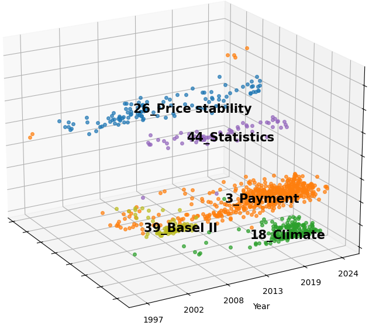

# Central Bank Speeches: A Space of Central Bankers’ Ideas

[](https://www.python.org/downloads/release/python-3126/)
[](https://github.com/MaartenGr/BERTopic)

This project analyses central bank speeches to uncover patterns, trends, and topics of interest. Using advanced natural language processing (NLP) techniques, such as BERTopic and UMAP, it clusters and visualises speech data to provide insights into central bank policies and economic discussions.
This repository contanis the code for the analysis and visualisations presented in the paper "Central Bank Speeches: A space of Central Bankers' Ideas" by Taejin Park, Fernando Perez-Cruz and Hyun Song Shin. The research utilises a comprehensive dataset of around 20,000 central bank speeches from over 100 central banks spanning from 1987 to 2025.
<p align="center">
  
</p>

## Dataset
The dataset used in this research is available at: [https://huggingface.co/datasets/tpark-bis/central_bank_speeches](https://huggingface.co/datasets/tpark-bis/central_bank_speeches)
The dataset includes:
- Speech transcripts with metadata (speaker, institution, date, title)
- Standardized speech summaries
- Speaker position classifications
- Pre-computed embeddings (3,072-dimensional via OpenAI's 'text-embedding-3-large')
- Topic representations

## Key applications
This repository provides code for the analytical applications demonstrated in the paper:
1. **Global Communication Landscape Analysis**: Code for mapping the central banking discourse landscape, revealing institutional and regional clustering patterns.
2. **Topic Modeling and Visualisation**: Implementation of our approach to identify natural communication clusters and visualise them through dimensionality reduction.
3. **Institutional Analysis**: Specific analysis of a major central bank (ECB) communication patterns and evolution.
4. **Temporal Evolution Analysis**: Tools for examining how central bank communication has evolved over time, particularly in response to economic events.

## Installation

1. Ensure you have Python 3.12.6 installed.
2. Clone this repository:
   ```bash
   git clone https://github.com/your-repo/central-bank-speeches.git
   cd central-bank-speeches
    ```
3. Install the required packages:
   ```bash
   pip install -r requirements.txt
   ```
4. Log in to HuggingFace to authenticate the dataset download:
   ```bash
   huggingface-cli login
   ```

## Files
- `train.py`: The main script for topic modeling, visualization, and data export.
- `euro_area_cpi.csv`: Monthly inflation of the Euro area from Federal Reserve Bank of St. Louis (FRED).
- `metadata.jsonld`: Metadata describing the dataset structure and fields.
- `requirements.txt`: Lists all dependencies required for the project.

## Saved Folder (created at runtime)

- `/plots` saves the graphs in `png` and `pdf` format.
- `/models` saves the `BERTopic` models as `safetensors`.

## Notes

Topic modeling using `BERTopic` is non-deterministic. Consequently, custom string mappings used in the code to clarify topic names may vary across different runs. To address this, we have included them as placeholders and encourage new users to adapt and create their own mappings as needed.


